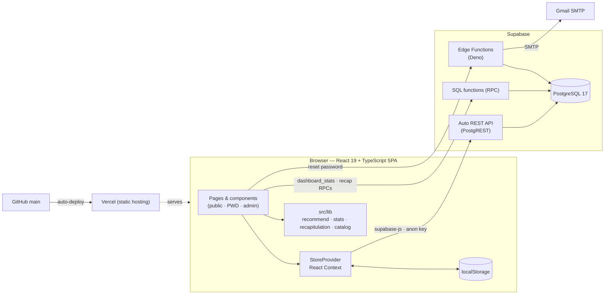
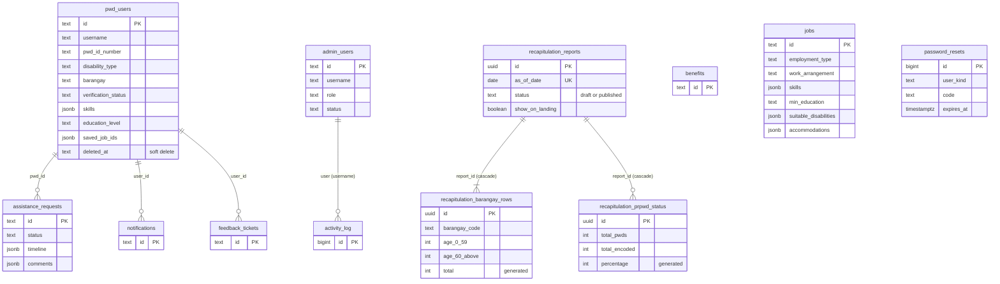
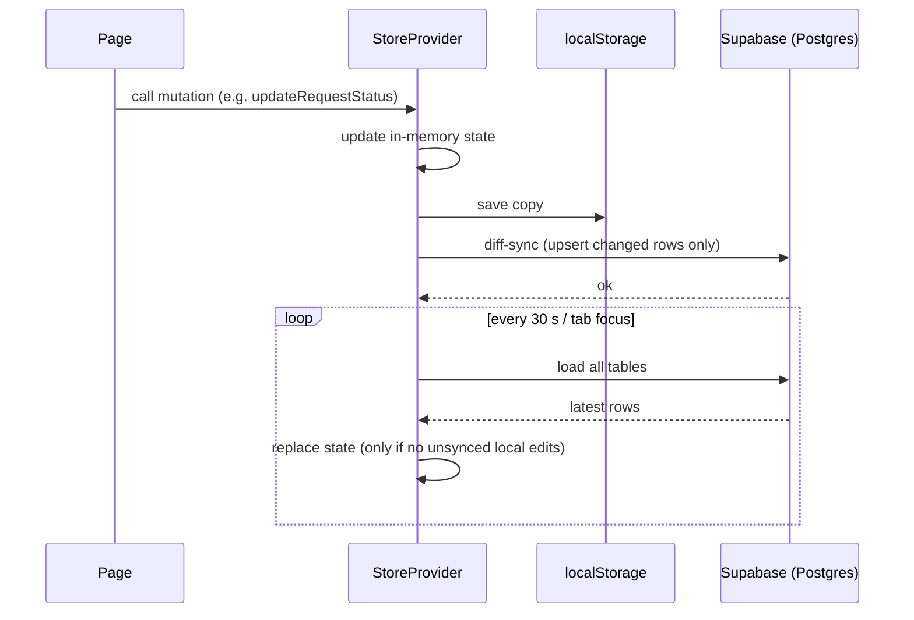
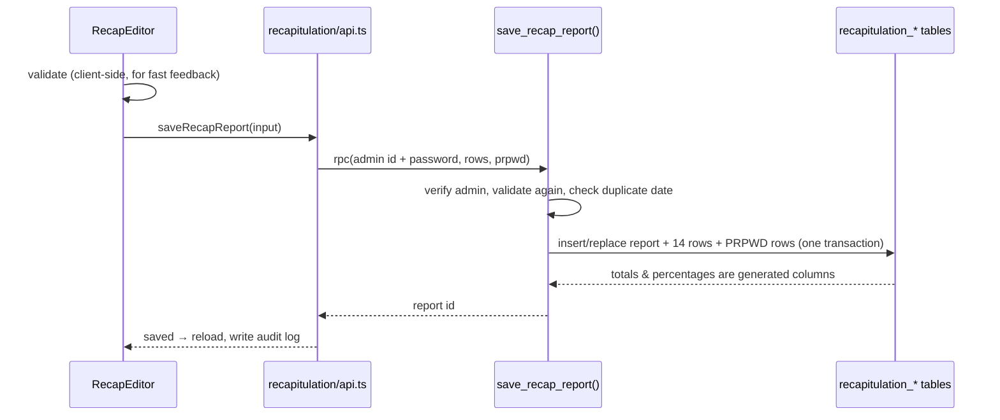
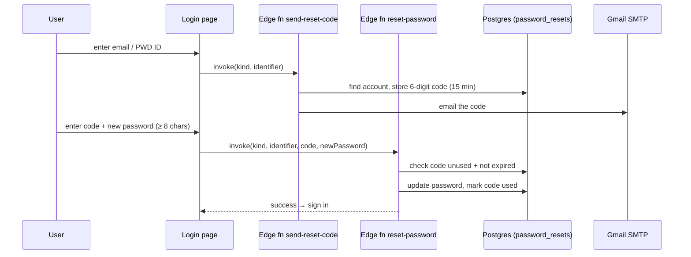

# EqualAccess Portal — System Architecture & Technology Stack

**Project:** EqualAccess Portal for the Persons with Disability Affairs Office (PDAO), Los Baños, Laguna
**Production:** https://equal-access-portal.vercel.app/
**Document scope:** what the system is, every technology used and why, how the parts fit together, how data moves, and what is known to be a limitation.

---

## Table of contents

1. [System overview](#1-system-overview)
2. [Technologies used](#2-technologies-used)
3. [High-level architecture](#3-high-level-architecture)
4. [Frontend architecture](#4-frontend-architecture)
5. [Database & backend architecture](#5-database--backend-architecture)
6. [Feature modules](#6-feature-modules)
7. [Key data flows](#7-key-data-flows)
8. [Roles and access](#8-roles-and-access)
9. [Build, environments & deployment](#9-build-environments--deployment)
10. [Testing](#10-testing)
11. [Accessibility & design system](#11-accessibility--design-system)
12. [Known limitations & recommended hardening](#12-known-limitations--recommended-hardening)
13. [Quick reference](#13-quick-reference)

---

## 1. System overview

EqualAccess Portal is a web system that lets PWDs of Los Baños register, apply for PDAO benefits and assistance, get job recommendations, and communicate with PDAO staff, while giving PDAO staff one place to verify PWDs, process requests, and report on the PWD population.

It has three areas:

| Area | Who uses it | What it does |
|---|---|---|
| **Public** | Anyone | Landing page (about, how it works, featured programs, FAQ, contact, optional PWD population table), **Login**, **Register**, forgot-password |
| **PWD portal** | Registered PWDs | Dashboard, profile and employment profile, benefits & programs, assistance requests and tracking, job recommendations, feedback & support, notifications, settings |
| **Admin portal** | PDAO staff (Administrator, Benefits Officer, Social Worker, Records Officer) | Dashboard, PWD management and verification, benefits & programs, assistance request processing, reports & analytics, **PWD Recapitulation**, feedback & support, user management, settings |

It is a **single-page application (SPA)** that talks **directly to a hosted PostgreSQL database (Supabase)**. There is **no custom backend server**; the small amount of server-side logic lives in database functions and two Supabase Edge Functions.

---

## 2. Technologies used

### 2.1 Summary

| Layer | Technology | Version | Used for |
|---|---|---|---|
| **Frontend framework** | **React** | 19 | Component-based UI (function components + hooks) |
| **Language** | **TypeScript** | 5.7 | Static typing across the whole codebase (`strict` mode, no unused locals/params) |
| **Build tool / dev server** | **Vite** | 8 | Dev server with hot reload, production bundling, code splitting |
| **Styling** | **Tailwind CSS** | 4 (via `@tailwindcss/vite`) | Utility-first styling and the custom theme (`ea-teal`, `ea-blue` palette, glass-style cards) |
| **Fonts** | Inter, Plus Jakarta Sans | Google Fonts | Body text (Inter) and headings (Plus Jakarta Sans) |
| **Icons** | **lucide-react** | 1.x | All icons |
| **Charts** | **Recharts** | 3 | Dashboard, Reports and Recapitulation charts (bar, line, donut) |
| **Excel export** | **ExcelJS** | 4.4 | `.xlsx` export with real formulas (loaded on demand) |
| **Database** | **PostgreSQL** (hosted by **Supabase**) | 17 (per `supabase/config.toml`) | All persistent data, generated columns, SQL functions, row-level security |
| **DB client** | **@supabase/supabase-js** | 2 | Reads/writes tables, calls SQL functions (RPC) and Edge Functions from the browser |
| **Serverless functions** | **Supabase Edge Functions** (Deno runtime) | — | Password-reset code email and password update |
| **Email** | **Nodemailer** over **Gmail SMTP** | 6.9 | Sending the 6-digit reset code |
| **Hosting** | **Vercel** | — | Static hosting of the built app, auto-deploy from GitHub `main` |
| **Source control** | **Git + GitHub** | — | Version control, triggers Vercel deployments |
| **Package manager** | **npm** | — | Dependencies (`package-lock.json` must stay in sync or Vercel builds fail) |
| **Testing** | **Vitest** | 5 | Unit tests for business logic |
| **Script runner** | **tsx** + **dotenv** | 4 / 18 | Running TypeScript seed scripts against the database |
| **Formatter** | **oxfmt** | 0.2 | Code formatting (`npm run format`) |
| **Database tooling** | **Supabase CLI** | 2.x | Applying migrations (`supabase db push`), deploying Edge Functions |
| **Design/prototyping** | Figma Make | — | The project was created in Figma Make; `vite.config.ts` contains Figma preview plugins that only run in dev |

### 2.2 What is *not* used (and why it matters for explaining the design)

| Not used | What is used instead |
|---|---|
| A custom backend (Express, Laravel, Django…) | Supabase (Postgres + auto-generated REST API) called straight from the browser |
| React Router / URLs per page | A single `page` state value in `App.tsx` (see [4.2](#42-entry-point-and-navigation)) |
| Redux / Zustand / React Query | One React Context store (`src/store.tsx`) that loads all tables, keeps them in memory and syncs changes back |
| Supabase Auth / JWT | An in-app login that compares credentials stored in the `pwd_users` / `admin_users` tables (see [6.1](#61-authentication-and-sessions)) |
| A component library (MUI, shadcn…) | A small in-house design system in `src/components/ui.tsx` |
| Machine learning | A transparent rule-based recommendation engine (see [6.5](#65-job-recommendation-engine)) |

---

## 3. High-level architecture

```
┌──────────────────────────────── Browser (React 19 SPA, built by Vite) ────────────────────────────────┐
│                                                                                                        │
│   Pages (public / PWD / admin)  ──►  StoreProvider (React Context, src/store.tsx)                      │
│        │                                   │  keeps every table in memory                              │
│        │                                   │  ├─ localStorage  (offline / first-paint copy)            │
│        │                                   │  └─ diff-sync + 30 s refresh ◄────────────┐               │
│        ▼                                   ▼                                            │               │
│   src/lib/*  (pure business logic: recommend, stats, recapitulation, catalog, normalize)│               │
│                                                                                         │               │
└───────────────────────────────────────────────┬─────────────────────────────────────────┼───────────────┘
                                                │ HTTPS (supabase-js, public anon key)     │
                       ┌────────────────────────┴───────────┬───────────────────────────┐ │
                       ▼                                    ▼                           ▼ │
              Table reads/writes                   SQL functions (RPC)         Edge Functions (Deno)
              (auto REST API)                      dashboard_stats()           send-reset-code
                       │                           get/save/delete_recap_report reset-password
                       │                           seed_recapitulation_snapshot     │   │
                       ▼                                    ▼                       │   ▼
        ┌──────────────────────────── Supabase · PostgreSQL 17 ───────────────┐    │  Gmail SMTP
        │ pwd_users · admin_users · benefits · assistance_requests · jobs ·   │◄───┘  (reset code email)
        │ notifications · feedback_tickets · activity_log · password_resets · │  service-role key
        │ recapitulation_reports / _barangay_rows / _prpwd_status             │
        └──────────────────────────────────────────────────────────────────────┘

        Hosting: GitHub (main) ──push──► Vercel (build: vite build) ──► https://equal-access-portal.vercel.app
```



**Design in one sentence:** a static React app served from Vercel that reads and writes a Supabase Postgres database directly, using SQL functions for anything that must be computed or protected on the server.

---

## 4. Frontend architecture

### 4.1 Folder structure

```
EqualAccess-Portal/
├─ index.html                     Vite entry HTML (mounts #root, loads src/main.tsx)
├─ vite.config.ts                 Vite + React + Tailwind plugins, "@" alias → src, dev port 8443
├─ tsconfig.json                  TypeScript strict config
├─ package.json / package-lock.json
├─ .env / .env.example            VITE_SUPABASE_URL, VITE_SUPABASE_ANON_KEY
├─ AGENTS.md / CLAUDE.md          Project notes for AI coding assistants
├─ scripts/
│   ├─ seed.ts                    Wipes and re-seeds all demo data (npm run seed)
│   └─ seed-recapitulation.ts     Inserts the Apr 30, 2026 recapitulation snapshot (npm run seed:recap)
├─ supabase/
│   ├─ config.toml                Supabase CLI config (project, Postgres 17)
│   ├─ migrations/                Versioned SQL schema (6 files, see section 5.3)
│   └─ functions/
│       ├─ send-reset-code/       Edge Function: create + email a 6-digit code
│       └─ reset-password/        Edge Function: verify the code, set new password
└─ src/
    ├─ main.tsx                   React root (StrictMode)
    ├─ App.tsx                    Page switch + login handling + session
    ├─ index.css                  Tailwind import, theme tokens, fonts, glass utilities
    ├─ context.ts                 Session context (who is logged in)
    ├─ store.tsx                  Global data store (load, mutate, sync, refresh)
    ├─ data.ts                    TypeScript types + demo seed data
    ├─ components/
    │   ├─ Layout.tsx             PWDLayout / AdminLayout: collapsible sidebar, header, notifications, help
    │   ├─ ui.tsx                 Design system: Button, Card, Input, Select, Modal, Tabs, Badge, Alert, …
    │   ├─ charts.tsx             Chart card with text alternative, dashboard skeleton, live status bar
    │   ├─ SkillsPicker.tsx       Skill chips + suggestions (used for job recommendations)
    │   └─ recapitulation/        RecapEditor, RecapCharts, RecapPrintView, PublicRecap
    ├─ pages/
    │   ├─ Landing.tsx · Login.tsx · Register.tsx
    │   ├─ pwd/                   Dashboard, Profile, EmploymentProfile, Benefits, Requests,
    │   │                         RequestTracking, Jobs, RecommendationSetup, Feedback, Notifications, Settings
    │   └─ admin/                 Dashboard, PWDManagement, BenefitsManagement, RequestManagement,
    │                             Reports, Recapitulation, FeedbackAdmin, UserManagement, Settings
    └─ lib/
        ├─ supabase.ts            Supabase client (null if env vars are missing)
        ├─ db.ts                  snake_case ↔ camelCase mapping, load all tables, diff-sync, reset
        ├─ catalog.ts             Single source of truth: 14 barangays, disability types, job vocabulary, Manila date helper
        ├─ normalize.ts           Reads older stored shapes into the current model
        ├─ passwordReset.ts       Calls the two Edge Functions
        ├─ stats.ts               Every dashboard/report metric + reconciliation checks
        ├─ useDashboardStats.ts   Live statistics hook (DB function → fallback to in-memory)
        ├─ recommend/             Job recommendation engine (+ taxonomy.json)
        └─ recapitulation/        Recapitulation types, compute, api, export (CSV/XLSX), seed data
```

### 4.2 Entry point and navigation

- `index.html` → `src/main.tsx` renders `<App />` inside `React.StrictMode`.
- `App` wraps everything in `<StoreProvider>`; `AppInner` holds two pieces of state: **`page`** and **`session`**.
- **There is no URL router.** Navigation is `setPage('pwd-jobs')`, `setPage('admin-recapitulation')`, etc. A `switch` renders the matching page component inside `PWDLayout` or `AdminLayout`. Consequences: URLs do not change per page, and a browser refresh returns to the landing page and signs the user out (the session is memory-only).
- Page identifiers are a TypeScript union (`Page`), so a wrong page name is a compile error.

### 4.3 State management

Two React contexts:

| Context | File | Holds |
|---|---|---|
| `SessionContext` | `context.ts` | `{ type: 'pwd', userId }` or `{ type: 'admin', adminId, role }` or `null`; hooks `useSession`, `usePWDSession`, `useAdminSession` |
| Store context | `store.tsx` | Every table in memory (`pwdUsers`, `benefits`, `assistanceRequests`, `notifications`, `jobs`, `adminUsers`, `feedbackTickets`, `activityLog`) plus all mutation functions (`registerPWD`, `updateProfile`, `addRequest`, `verifyPWD`, `updateRequestStatus`, `logActivity`, …) |

How the store keeps data consistent with the database:

1. **Startup:** render immediately from `localStorage` (or the built-in seed data), then load all tables from Supabase. If the database is empty, the seed data is written to it.
2. **On every change:** the store updates React state, saves to `localStorage`, and **diff-syncs** to Supabase — only rows whose object identity changed are upserted, and removed rows are deleted (`syncStateToSupabase`). Untouched rows are never rewritten, so one stale browser cannot overwrite someone else's edits to other rows.
3. **Sync queue:** writes are serialised. If one fails, the same diff is retried on the next change.
4. **Refresh:** every **30 seconds**, and whenever the tab regains focus, the store re-reads the database — but never while local edits are still unwritten.
5. **Offline / no database:** if `VITE_SUPABASE_*` is missing or unreachable, the app runs entirely from `localStorage` (key `equalaccess-portal:v2`).
6. **Soft delete:** deleting a PWD sets `deleted_at`; the record disappears from every list and count but stays in the database.
7. **Activity log:** admin actions append to `activity_log` (who, action, when, description).

### 4.4 Layout and UI

- `Layout.tsx` provides `PWDLayout` and `AdminLayout`: a gradient sidebar (teal for PWD, slate for admin), a sticky glass header (search, notifications or activity/help), and a scrolling `<main>`.
- **Collapsible sidebar** (desktop): expanded (240 px, labels) or collapsed (72 px, icons with tooltips). The choice is remembered in `localStorage`. On mobile the sidebar is an off-canvas drawer.
- `ui.tsx` is the in-house component library: `Button`, `Card`, `PageHeader`, `Input`, `PasswordInput`, `Select`, `Textarea`, `CheckboxGroup`, `Modal` (focus trap, Escape to close, focus restore), `Alert`, `Badge`, `EmptyState`, `StatsCard`, `Tabs`, `SearchBar`, `FileUpload`, `Timeline`, `Pagination`.
- Styling is Tailwind utility classes plus theme tokens in `index.css` (`ea-teal-*`, `ea-blue-*`, glass card utilities, animations).

---

## 5. Database & backend architecture

### 5.1 Tables



Relationships in the app tables (`pwd_users` ↔ requests, notifications, tickets) are logical (matched by id in the app); only the recapitulation tables use real foreign keys.

| Table | Purpose |
|---|---|
| `pwd_users` | PWD accounts, profile, employment profile (skills, education, preferences, accommodation needs), saved jobs, verification status |
| `admin_users` | PDAO staff accounts and roles |
| `benefits` | Benefit / program catalog (category, eligibility, barangay, deadline, requirements) |
| `assistance_requests` | A PWD's request with status, comments and a timeline |
| `notifications` | Per-user or global notifications |
| `feedback_tickets` | Feedback and support conversations (with responses, optional anonymity) |
| `activity_log` | Audit trail of admin actions |
| `jobs` | Job listings used by the recommendation engine (seeded; no admin editing page) |
| `password_resets` | One-time 6-digit reset codes (locked to Edge Functions only) |
| `recapitulation_reports` / `_barangay_rows` / `_prpwd_status` | Dated PWD population snapshots per barangay and age bracket, plus DOH PRPWD encoding progress |
| `job_applications` | **Legacy** table from an earlier version; no longer used by the app |

Barangay and disability type are plain text columns; their allowed values live in `src/lib/catalog.ts`, so changing those lists needs no migration.

### 5.2 Server-side logic

**Postgres functions (called with `supabase.rpc`)**

| Function | Purpose |
|---|---|
| `dashboard_stats()` | Computes every dashboard and report number inside the database (PWD counts, requests by status, by month/barangay/disability). The app falls back to in-memory numbers if it fails |
| `get_recap_reports(admin_id, secret)` | Admin-only: all recapitulation reports with rows |
| `save_recap_report(...)` | Admin-only: creates or replaces a report and its 14 rows + PRPWD rows **in one transaction**; validates everything |
| `delete_recap_report(...)` | Admin-only delete (cascades to child rows) |
| `recap_assert_admin(...)` | Internal: re-checks the admin's id + password; not callable by anon |
| `seed_recapitulation_snapshot()` | Idempotent seeder for the April 30, 2026 snapshot; refuses to finish unless totals are 6,727 / 1,207 / 7,934 |

**Generated columns** (computed by PostgreSQL, so a client cannot store a wrong value): `recapitulation_barangay_rows.total` and `recapitulation_prpwd_status.percentage`.

**Edge Functions (Deno, run with the service-role key)**

| Function | What it does |
|---|---|
| `send-reset-code` | Finds the account by email / PWD ID / username, invalidates older codes, stores a new 6-digit code (valid 15 minutes) in `password_resets`, emails it through Gmail SMTP with Nodemailer |
| `reset-password` | Finds the account, checks the code exists, is unused and not expired, checks the new password is at least 8 characters, updates the password, marks the code used |

### 5.3 Migrations (`supabase/migrations`, applied with `supabase db push`)

| File | Adds |
|---|---|
| `20260918000000_initial_schema.sql` | The 9 original tables and row-level-security policies |
| `20260918010000_password_resets.sql` | `password_resets` table |
| `20260918020000_lock_password_resets.sql` | Removes the open policy on `password_resets` and denies anon/authenticated access entirely |
| `20260919000000_job_recommendation_accessibility.sql` | `preferred_location`, `screen_or_visual_demands` |
| `20260921000000_jobs_and_live_stats.sql` | New job columns, PWD education level / saved jobs / soft delete, `dashboard_stats()` |
| `20260922010000_recapitulation.sql` | Recapitulation tables, admin functions, RLS, seeder |

### 5.4 Row-level security (RLS) summary

| Tables | Policy |
|---|---|
| Original app tables (including the legacy `job_applications`) | Open read/write for the public anon key (`using (true)`) — the app enforces roles itself |
| `password_resets` | Denied to everyone except the service role (Edge Functions) |
| `recapitulation_*` | **No write policies.** Public read only for a report that is published **and** marked "show on landing". Everything else goes through the admin-only functions above |

---

## 6. Feature modules

### 6.1 Authentication and sessions

- **Login** (`Login.tsx` + `validateCredentials` in `App.tsx`): PWD users sign in with **PWD ID number** (or username / id) and password; admins sign in with **username** and password. The app compares against the loaded `pwd_users` / `admin_users` rows (active, non-deleted accounts only; the verification badge is shown on the dashboard) and stores `{type, id, role}` in `SessionContext` (memory).
- **Registration** (`Register.tsx` → `registerPWD`): creates a PWD account with `Pending` verification status; a PDAO admin then **verifies or rejects** it (`verifyPWD`) and the PWD is notified.
- **Forgot password:** see [7.3](#73-forgot-password-sequence).
- **Roles:** Administrator, Benefits Officer, Social Worker, Records Officer.

### 6.2 PWD portal

| Page | Function |
|---|---|
| Dashboard | Welcome banner, quick actions, stats, recommended programs, top job match, recent requests, notifications |
| My Profile | Personal, contact and account information, employment profile, password change |
| Benefits & Programs | Browse programs; "Apply" opens the request form pre-filled with that program |
| Assistance Requests / Request Tracking | Submit requests (with drafts) and follow status through a timeline |
| Job Recommendations | See [6.5](#65-job-recommendation-engine) |
| Feedback & Support | Send messages (optionally anonymous) and read replies |
| Notifications | Per-user notification list |
| Settings | Account overview and password |

### 6.3 Admin portal

| Page | Function |
|---|---|
| Dashboard | Live statistics and charts, recent activity |
| PWD Management | Search, verify/reject, edit, deactivate/reactivate, soft-delete PWDs |
| Benefits & Programs | Create, edit, activate/deactivate, delete programs |
| Assistance Requests | Review, change status (timeline updates), comment, notify the PWD |
| Reports & Analytics | Filterable statistics (date range, barangay, disability) with charts |
| Recapitulation | See [6.6](#66-pwd-recapitulation-admin) |
| Feedback & Support | Reply to tickets, change status, internal notes |
| User Management | Add, edit, activate/deactivate admin accounts, reset passwords |
| Settings | System information, JSON backup export, reset demo data |

### 6.4 Live statistics (`src/lib/stats.ts`, `useDashboardStats.ts`)

One aggregation rule set serves every dashboard and report so numbers always reconcile. With a database configured, `dashboard_stats()` runs in Postgres and is re-run after each change, on a 30 s timer and when the tab regains focus; otherwise the same metrics are computed from the in-memory data. `statsViolations` checks invariants (for example that percentages add up to 100).

### 6.5 Job recommendation engine

Location: `src/lib/recommend/`. It is **rule-based and explainable**, not machine learning.

- **Gate:** nothing is recommended until the PWD has entered **skills** and **highest education** (`canRecommend`); the Jobs page shows a setup form first. PWDs cannot apply; the page is recommendations only.
- **Score (0–100):** skills 35 · disability suitability & accommodations 25 · education 15 · location 15 · work type / arrangement preference 10.
- **Filters:** minimum score 40 **and** at least 40 % skill coverage. A job is hidden for a PWD only if the employer explicitly restricted it to other disability types (disability type is otherwise only a positive signal).
- **Skill matching:** `taxonomy.json` maps different wordings (including Tagalog) to one canonical skill (`synonyms`) and lists close skills that earn 0.4 credit (`related`). Matching is whole-word, so "Excellent" does not match "Excel".
- **Location:** same barangay > elsewhere in Los Baños > elsewhere in Laguna > far; remote jobs need no commute.
- Each result carries "why this match" reasons and a score breakdown shown in the UI.
- **Accuracy check:** `accuracy.test.ts` scores the engine against hand-labelled applicant/job pairs (precision and recall ≥ 90 %).

### 6.6 PWD Recapitulation (admin)

Location: `src/pages/admin/Recapitulation.tsx`, `src/components/recapitulation/`, `src/lib/recapitulation/`.

- Snapshot of "Total Number Strength of Persons With Disabilities in Los Baños" per barangay (14) and age bracket (0–59, 60-above), plus DOH PRPWD encoding status.
- **Editor:** live row and grand totals, validation (whole numbers ≥ 0, encoded ≤ total, one report per as-of date), save as draft or publish, copy from another report, delete with confirmation.
- **Server guarantees:** totals/percentages are generated columns; saves run in one transaction; every read/write function re-verifies the admin.
- **Views:** summary cards, sortable/searchable table with highest/lowest highlight and share %, PRPWD progress bars, three charts (per barangay, age split, snapshot comparison).
- **Export:** CSV (UTF-8 with BOM, so "Baños" opens correctly) and Excel with live `SUM` / `=C+D` formulas, A4 portrait fit-to-width, frozen header; optional analytics columns/sheet; print layout; optional read-only section on the landing page.

### 6.7 Cross-cutting

- **Audit log:** admin actions are written to `activity_log` (visible in the admin header).
- **Time zone:** all date logic uses Asia/Manila (`manilaDate` in `catalog.ts`).
- **Data compatibility:** `normalize.ts` upgrades older stored job/user shapes on read, so old data keeps working.

---

## 7. Key data flows

### 7.1 Reading and writing normal data



### 7.2 Recapitulation save (server-checked)



### 7.3 Forgot-password sequence



---

## 8. Roles and access

| Capability | Guest | PWD | Admin staff |
|---|:-:|:-:|:-:|
| View landing page (and published recap if enabled) | ✅ | ✅ | ✅ |
| Register / log in / reset password | ✅ | ✅ | ✅ |
| Own profile, requests, jobs, feedback, notifications | — | ✅ | — |
| Verify PWDs, process requests, manage programs | — | — | ✅ |
| Reports & analytics, Recapitulation, user management, settings | — | — | ✅ |

Enforcement:
- **UI level:** page groups (`PWD_PAGES`, `ADMIN_PAGES`), separate layouts, and the Recapitulation page renders an "Administrators only" message without a valid admin session.
- **Database level:** only the recapitulation module and `password_resets` are protected in the database itself (see [12](#12-known-limitations--recommended-hardening)).

---

## 9. Build, environments & deployment

**Environment variables** (Vite inlines `VITE_*` values at build time):

| Variable | Where | Purpose |
|---|---|---|
| `VITE_SUPABASE_URL` | `.env` and Vercel | Supabase project URL |
| `VITE_SUPABASE_ANON_KEY` | `.env` and Vercel | Public anon key |
| `SMTP_HOST`, `SMTP_PORT`, `SMTP_USER`, `SMTP_PASS` | Supabase Edge Function secrets | Gmail SMTP for reset codes |
| `SUPABASE_SERVICE_ROLE_KEY` | Provided to Edge Functions by Supabase | Server-only access (never in the frontend) |

**Deployment pipeline**

1. Push to GitHub `main`.
2. Vercel builds with `vite build` (fails if `package-lock.json` is out of sync with `package.json`).
3. Static output is served at https://equal-access-portal.vercel.app/.
4. Database changes are applied separately with `supabase db push`; Edge Functions with `supabase functions deploy`.

**Bundle notes:** `exceljs` is loaded on demand (its own ~930 kB chunk) only when an admin exports to Excel, so it does not slow the main app.

---

## 10. Testing

Framework: **Vitest** (`npm run test`), all in `src/lib`:

| Test file | Covers |
|---|---|
| `recommend/recommend.test.ts` | Scoring weights, each component, eligibility rules, the skills-and-education gate |
| `recommend/accuracy.test.ts` | Skill vocabulary and precision/recall on labelled applicant–job pairs |
| `stats.test.ts` | Dashboard metrics and reconciliation invariants |
| `recapitulation/recapitulation.test.ts` | Seed totals (6,727 / 1,207 / 7,934), derived numbers, validation, audit summary, CSV layout/BOM/quoting, Excel formulas and print setup, and that the SQL seeder matches the TypeScript seed |

The recapitulation SQL was also exercised against a local PostgreSQL (in-memory) covering the admin gate, validation, transactions, generated columns and RLS.

---

## 11. Accessibility & design system

- Semantic HTML: landmarks (`banner`, `main`, sidebar `nav`), table captions/`scope`, `aria-current`, `aria-sort`, `aria-live` status messages, `aria-expanded` on toggles.
- Keyboard support: focus-visible rings, modal focus trap with Escape and focus restore.
- Charts have a text alternative (summary + hidden data table).
- Status is never colour-only (icons and text accompany colour).
- Responsive layout: off-canvas sidebar on mobile, horizontally scrolling tables, multi-column layouts on wide screens.
- A print stylesheet for the recapitulation (A4 portrait, table only).
- Brand: teal/blue palette, Inter + Plus Jakarta Sans, glass-style cards.

---

## 12. Known limitations & recommended hardening

These are honest trade-offs of the current architecture, worth stating in any review.

| # | Limitation | Why it exists | Recommended fix |
|---|---|---|---|
| 1 | **Passwords are stored in plain text** in `pwd_users` / `admin_users` and compared in the browser | Simple demo-style auth | Move to **Supabase Auth**, or hash with bcrypt/argon2 inside Edge Functions and verify server-side |
| 2 | **Original app tables are open** to anyone with the public anon key (`using (true)` policies), including `admin_users`, which exposes those passwords | The app enforces roles only in the UI | Tighten RLS with real identities (Supabase Auth JWT) so PWDs can read only their own rows and only admins can read `admin_users` |
| 3 | The recapitulation admin check relies on limitation 1 (it verifies the admin's stored password) | Best possible without real auth | Replace `recap_assert_admin` with a check on the authenticated user's role once Supabase Auth is used |
| 4 | **No URL routing**; refresh signs the user out | Single `page` state, memory-only session | Adopt React Router and persist the session (e.g. Supabase session) |
| 5 | The whole dataset is loaded into the browser and synced as a diff | Simple, works offline | Paginate or query per page as data grows; the current design suits a municipal-scale dataset |
| 6 | Activity log is replaced wholesale when it changes | Auto-generated ids | Append-only inserts of new entries |
| 7 | Job listings can only change through seed data (admin job page was removed) | Product decision | Reintroduce an admin listing page if employers need to post |
| 8 | Excel/CSV exports are generated in the browser, not on a server | No backend server | Move to an Edge Function if exports must be audited server-side |
| 9 | Legacy `job_applications` table remains in the database | Left in place to avoid a destructive migration | Drop it in a future migration |
| 10 | Gmail SMTP for email | Zero-cost setup | A transactional provider (Resend, SendGrid) for reliability |

---

## 13. Quick reference

**Commands**

```bash
npm install                     # install dependencies
npm run dev                     # dev server (Vite, default port 8443)
npm run build                   # production build
npm run test                    # Vitest suite
npm run seed                    # wipe + re-seed all demo data
npm run seed:recap              # insert the Apr 30, 2026 recapitulation snapshot if missing

supabase db push                # apply migrations to the linked project
supabase functions deploy send-reset-code
supabase functions deploy reset-password
supabase secrets set SMTP_HOST=... SMTP_PORT=... SMTP_USER=... SMTP_PASS=...
```

**Demo logins**

| Account | Username | Password |
|---|---|---|
| PWD user | PWD ID No., e.g. `LB-VIS-2023-00421` | `pwd123` |
| Admin staff | e.g. `pdao.admin` | `admin123` |

**Where to look first**

| I want to change… | Open |
|---|---|
| Barangay / disability / job vocabulary lists | `src/lib/catalog.ts` |
| Any data mutation or sync behaviour | `src/store.tsx`, `src/lib/db.ts` |
| Sidebar, header, page shell | `src/components/Layout.tsx` |
| Shared buttons, cards, inputs, modals | `src/components/ui.tsx` |
| Job match weights / thresholds | `src/lib/recommend/score.ts` |
| Skill wordings and related skills | `src/lib/recommend/taxonomy.json` |
| Dashboard numbers | `src/lib/stats.ts` and `dashboard_stats()` in the migrations |
| Recapitulation rules or exports | `src/lib/recapitulation/`, migration `20260922010000_recapitulation.sql` |
| Password reset email | `supabase/functions/send-reset-code/index.ts` |
